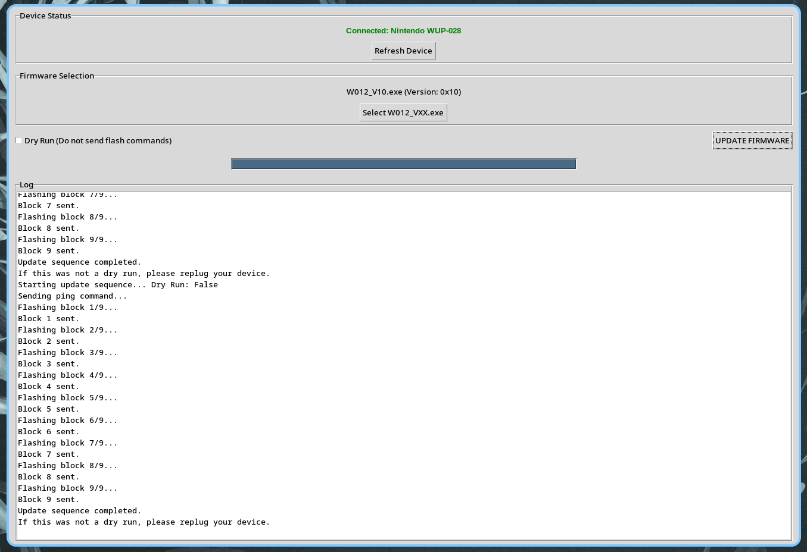

# Mayflash W012 Linux Firmware Updater & Analysis Tool

A reverse-engineered Python replacement for the official Windows firmware updater for the **Mayflash W012 GameCube Controller Adapter** (Wii U / PC USB).

This repository contains a GUI updater and a CLI utility that replicates the USB HID flashing protocol used by the official Windows `.exe` updaters.



> [!WARNING]
> **BRICK WARNING:** Because this tool uses a reverse-engineered flashing protocol and does not contain the inner bootloader decryption keys, **writing to the device's flash memory may result in a permanent hard-brick**. The tool includes a "Dry Run" mode enabled by default so you can safely test the UI and firmware parsing without sending destructive writes. Use at your own risk.

---

## Features

- **Extract Firmware:** Parses official Mayflash `W012_VXX.exe` files, locates the embedded firmware, and extracts the 9 encrypted blocks.
- **XOR Decryption:** Cracks the outer XOR encryption layer (key `0xCB`) to read block headers, firmware versions, and product IDs.
- **HID Protocol Implementation:** Implements the 64-byte USB HID report chunking protocol used by the official Windows updater.
- **Linux Native:** Works entirely in userspace using `hidapi`

## Requirements

- Linux (maybe would work on macos? not something I tested or will support at all)
- Python 3.8+
- `python3-tk` (for the GUI)
- `hid` and `pyusb` packages

### Setup Instructions

1. **Install Dependencies:**
   ```fish
   # Debian/Ubuntu
   sudo apt install python3-tk python3-venv
   
   # Arch Linux
   sudo pacman -S tk python-virtualenv
   ```

2. **Set Up Environment:**
   ```fish
   python3 -m venv .venv
   source .venv/bin/activate
   pip install hid pyusb
   ```

3. **Install Udev Rules (so you can actually interact with the adapter without root/sudo):**
   ```fish
   echo 'SUBSYSTEM=="hidraw", ATTRS{idVendor}=="057e", ATTRS{idProduct}=="0337", MODE="0666"' | sudo tee /etc/udev/rules.d/99-mayflash.rules
   sudo udevadm control --reload-rules
   sudo udevadm trigger
   ```

## Firmware Downloads

The updater requires the official Windows `.exe` files to extract the firmware payload. You can download them directly from Mayflash:

- [W012 V10 (Latest)](https://www.mayflash.com/app/system/entrance.php?m=include&c=access&a=dodown&lang=en&id=246)
- [W012 V09](https://www.mayflash.com/app/system/entrance.php?m=include&c=access&a=dodown&lang=en&id=240)
- [W012 V07](https://www.mayflash.com/app/system/entrance.php?m=include&c=access&a=dodown&lang=en&id=216)

## Usage

### GUI Version
Activate virtual environment and run the GUI script:
```fish
./w012_updater_gui.py
```
1. Click **Select W012_VXX.exe** and pick an official Mayflash firmware update file.
2. The tool will parse the file, extract the firmware, and display the embedded version.
3. Ensure **Dry Run** and run a test to verify it extracts everything without error
4. If all goes well, uncheck dry run and flash the firmware

### CLI Tool
```fish
./mayflash_tool.py info
./mayflash_tool.py listen
./mayflash_tool.py extract --exe W012_V10.exe --out extracted
```

---

## Reverse Engineering Documentation

Through somewhat hasty reverse engineering of the exe updater and a couple hours with my oscilloscope's mso:

### MCU Details
- The adapter uses an **HJM2130A** microcontroller (an obscure/custom Chinese MCU maybe? I couldn't find much about it online)
- It is an ARM Cortex-M based MCU, using  `0x20011000` as SRAM base.

### Dual-Layer Encryption
Mayflash implemented a dual-layer encryption scheme to protect their firmware:
1. **Outer Layer (easily defeated):** The firmware blob embedded inside the Windows `.exe` is obfuscated using a simple single-byte XOR key (`0xCB`). My 2 tools automatically strip this layer to parse the block headers.
2. **Inner Layer (Unbroken):** After stripping the XOR layer and the 32-byte protocol headers, the actual ARM firmware payload remains highly entropic (~7.994 entropy). There are no AES/DES constants or decryption routines inside the Windows executable. The decryption key lives exclusively inside the MCU's read-protected hardware bootloader. 

### USB Protocol
- The firmware is exactly `295,200` bytes, split into `9` blocks of `32,800` bytes.
- The updater chunks each block into 513 USB HID reports of `64` bytes each (prefixed with Report ID `0x00`).
- The protocol sends these blocks to the device, which acknowledges and decrypts them internally.

Because the inner layer is unbroken, **we cannot yet write custom firmware for this device** without dumping the physical bootloader via JTAG/SWD hardware exploitation.
